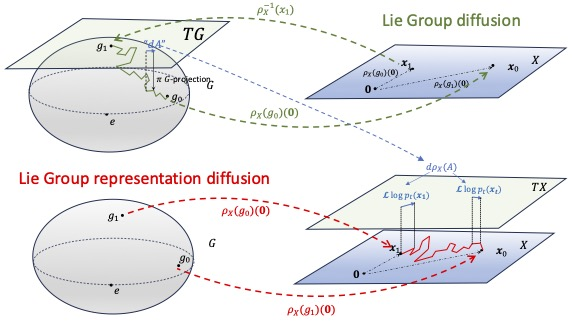
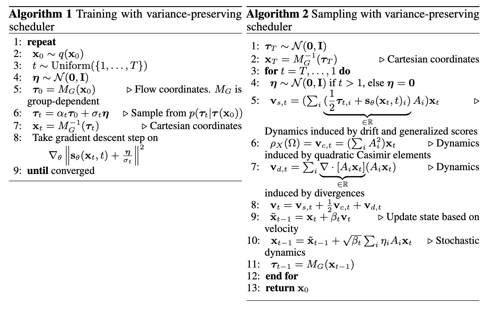

# Diffusion Generative Modeling on Lie Group Representations

**NeurIPS 2025 Spotlight Paper**



This repository contains the official implementation for our **NeurIPS 2025 Spotlight paper** _"Diffusion Generative Modeling on Lie Group Representations"_ by Marco Bertolini, Tuan Le and Djork-Arné Clevert.

## Abstract
We introduce a novel class of score-based diffusion processes that operate directly in the representation space of Lie groups. Leveraging the framework of Generalized Score Matching, we derive a class of Langevin dynamics that decomposes as a direct sum of Lie algebra representations, enabling the modeling of any target distribution on any (non-Abelian) Lie group. Standard score-matching emerges as a special case of our framework when the Lie group is the translation group. We prove that our generalized generative processes arise as solutions to a new class of paired stochastic differential equations (SDEs), introduced here for the first time. We validate our approach through experiments on diverse data types, demonstrating its effectiveness in real-world applications such as $SO(3)$-guided molecular conformer generation and modeling ligand-specific global 
 $SE(3)$ transformations for molecular docking, showing improvement in comparison to Riemannian diffusion on the group itself. We show that an appropriate choice of Lie group enhances learning efficiency by reducing the effective dimensionality of the trajectory space and enables the modeling of transitions between complex data distributions.

## Key Contributions

- **Generalized score matching via Lie algebras**: We extend generalized score matching to estimate scores of any distribution on a Lie group $G$ acting on $X$, with (Fisher) standard score-matching emerging as a special case for translation groups $G=T(N)$.

- **Novel class of solvable SDEs**: We introduce a new class of solvable stochastic differential equations that govern Lie group diffusion via Euclidean coordinates, significantly expanding the scope of score-based modeling techniques.

- **Dimensionality reduction and trajectory disentanglement**: We demonstrate that appropriate choice of Lie group $G$ reduces effective learning dimensionality and enables modeling of transitions between complex data distributions that are challenging for standard score matching.


## Installation
The environment is best installed using the conda or [mamba](https://github.com/mamba-org/mamba) packaging manager.

```bash
mamba env create -f environment.yaml
mamba activate sism
pip install torch_geometric
pip install pyg_lib torch_scatter torch_sparse torch_cluster torch_spline_conv -f https://data.pyg.org/whl/torch-2.2.0+cu118.html
pip install -e .
```

## Repository Structure
The code for the MNIST, QM9, CrossDocked2020 experiments can be found in the `mnist`, `qm9` and `plcomplex` directories under this root.

The experiments to the 2D and 3D distributions can be found in the `notebooks` directory.

Configuration files are stored in the `config` directory with default configurations saved in `config/base_qm9.yaml` and `config/base_crossdocked`.

## Experiments
Currently the experiments for the 2D/3D toy datasets, MNIST, and QM9 can be performed since the CrossDocked experiments require the upload of the dataset which we currently cannot share on Github. 

The code to run the generalized score model on CrossDocked with the forward and reverse dynamics can be however found in `plcomplex/model.py`

### MNIST
```bash
mamba activate sism
python sism/mnist/train.py --use_conv --save_dir $PATH_TO_SAVE_EXPERIMENT
```

### QM9

```bash
mamba activate sism
python sism/qm9/run_train.py --conf config/base_qm9.yaml
```

### CrossDocked2020
Requires the processed dataset which is currently not provided. The training would be executed via
```bash
mamba activate sism
python sism/plcomplex/run_train.py --conf config/base_crossdocked.yaml
```

### Toy Distributions
We provide the jupyter notebook code in the `notebooks` directory from this root.
Specifically, we implement generalized score matching networks within the SDE formalism and compare against Fisher score networks for 2D and 3D toy distributions.  
To run the python scripts, please look into `synthetic` directory.

## General Training and Sampling Algorithm

[](training_sampling_algorithms.png)

## License

This project is licensed under the Apache License 2.0 - see the [LICENSE](LICENSE) file for details.

## Reference
```
@inproceedings{
bertolini2025diffusion,
title={Diffusion Generative Modeling on Lie Group Representations},
author={Marco Bertolini and Tuan Le and Djork-Arn{\'e} Clevert},
booktitle={The Thirty-ninth Annual Conference on Neural Information Processing Systems},
year={2025},
url={https://openreview.net/forum?id=Jom8tNYuQI}
}
```